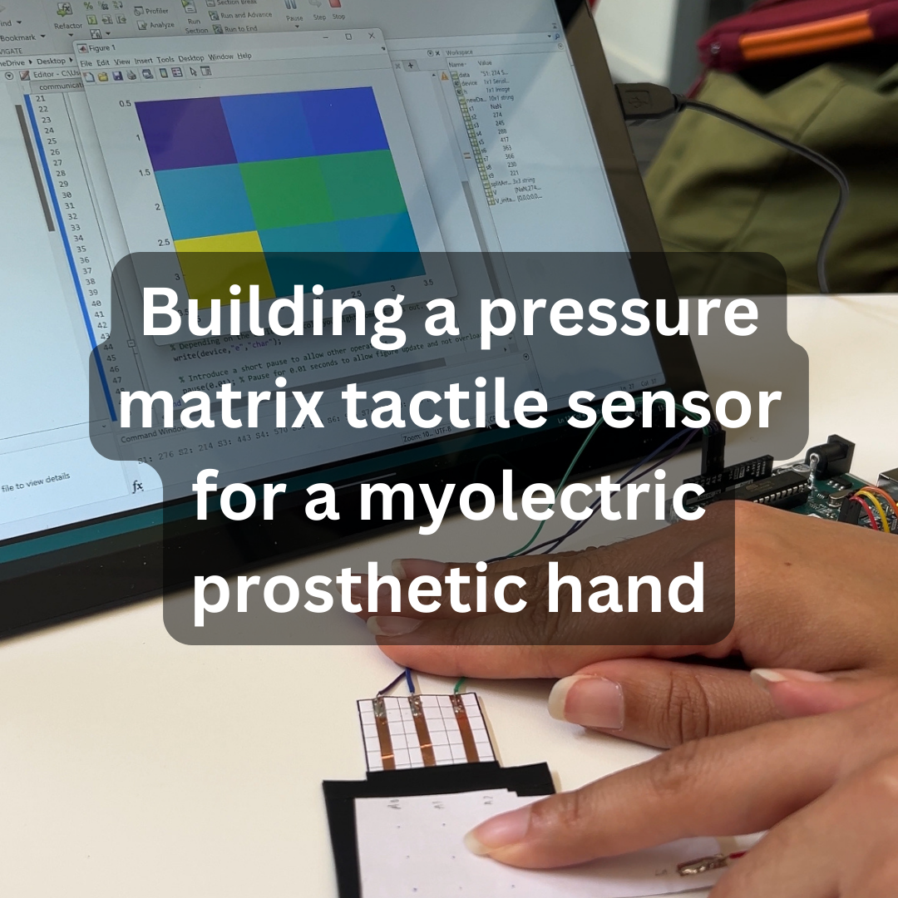

### Hi there 👋, my name is Kameron
#### Currently open to internship opportunities

I am currently pursuing my MSc in Artificial Intelligence and Machine Learning at the University of Birmingham Dubai. As a biomedical engineering graduate, with honours from Queen Mary University, I am passionate about healthcare related projects. With the MedTech industry developing so quickly, I do not want to be left behind. Because of this, I am learning about Python, C#, Unity, machine learning, deep learning, and microcontrollers.

Skills: Python / MATLAB / Arduino / C# / HTML / CSS

- 🔭 My most recent project, for my undergraduate thesis, was to develop a pressure matrix sensor for a myoelectric prosthetic hand 
- 🌱 I’m currently learning how to process EMG signals using machine learning techniques
- 📫 How to reach me: info@kameronslab.com

#### Current project (click to explore)

      

  

  
